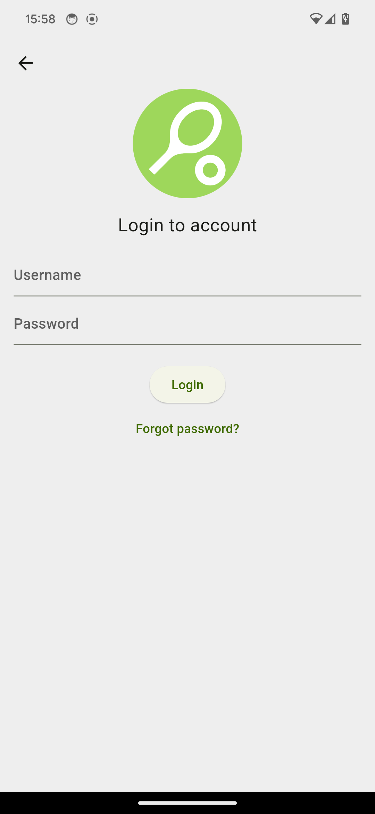
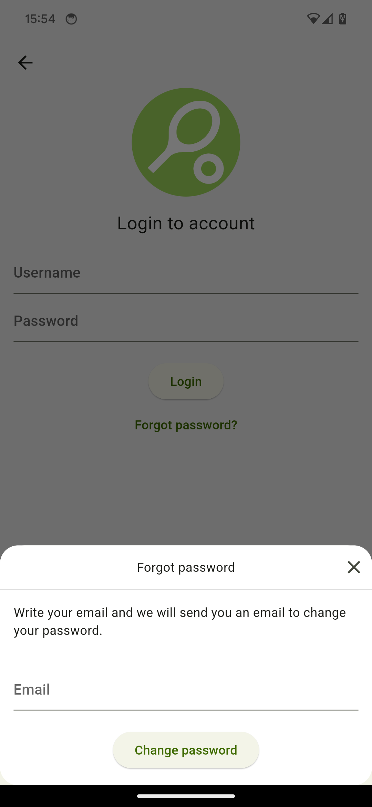
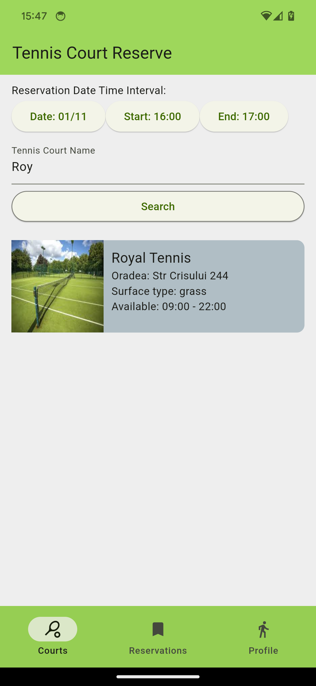

# Court Reserve Mobile App - Flutter

## Project
- Flutter version: 3.16.4
- Dart version: 3.2.3
- Architecture: 
  - MVVM
  - RxDart
  - Triple Pattern (UIModel -> handle success, loading, error)
- How to generate files: `dart run build_runner build`

## Presenting the app

### Register | Login | Forgot Password

  
   
   

* Forgot Password Feature - Deeplinks  
https://github.com/user-attachments/assets/8f596a49-e128-4346-9858-e23942147f97

### Tennis Courts Search

  
   

* If a user is not logged in and he tires to select a court, a popup is showed.
* If the user is logged in then he can see the details and make a reservation.

  
  

* The user can modify the hours and the price is updated accordingly

  
  

* The user can see pending, current and past reservations
* Here he can access reservation options

  
  

  
  

### Not Logged In Profile | Logged In Profile | Membership Plan Activated Profile
* User can login and logout 
* User can activate / deactivate membership plans
* If a membership plan is active, then the user does not need to pay the reservation, and the price is 0

  
  
  

### Host - Add Tennis Court
* Host can add tennis courts and view all their courts

  
  
  

  
  

* Host can edit tennis court details

  
  

* Hosts can view reservations and accept/decline them

  
  
  

https://github.com/user-attachments/assets/8f596a49-e128-4346-9858-e23942147f97

