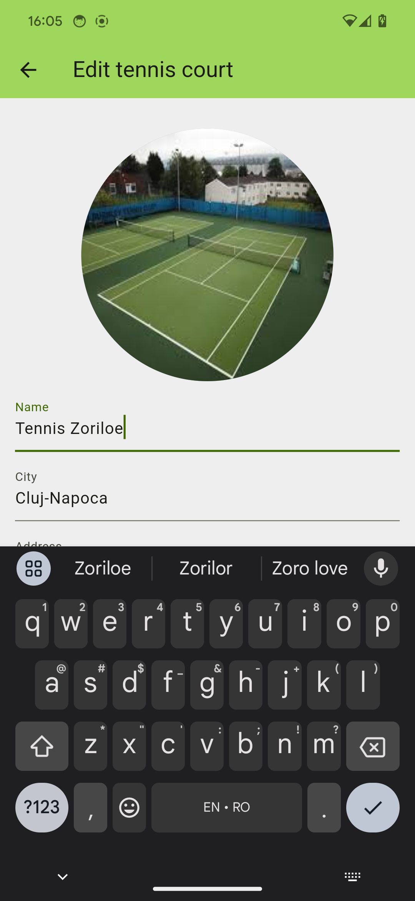
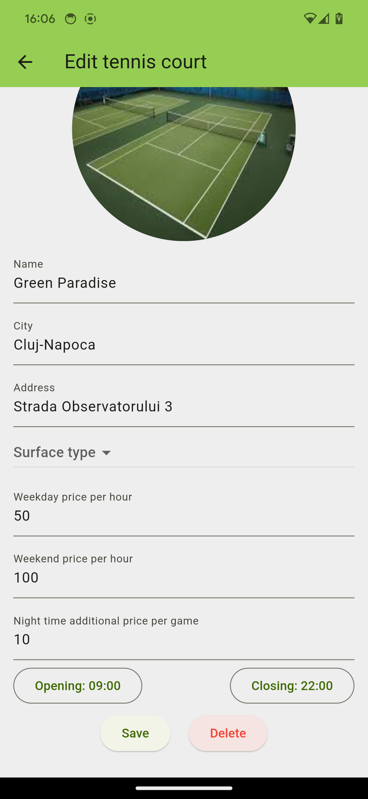

# Court Reserve Mobile App - Flutter

## Project
- Flutter version: 3.16.4
- Dart version: 3.2.3
- Architecture: 
  - MVVM
  - RxDart
  - Triple Pattern (UIModel -> handle success, loading, error)
- How to generate files: `dart run build_runner build`

## Presenting the app

### Register | Login | Forgot Password

  
   
   

### Tennis Courts Search

  
   

* If a user is not logged in and he tires to select a court, a popup is showed.
* If the user is logged in then he can see the details and make a reservation.

  
  

* The user can modify the hours and the price is updated accordingly

  
  

* The user can see pending, current and past reservations

  
  

